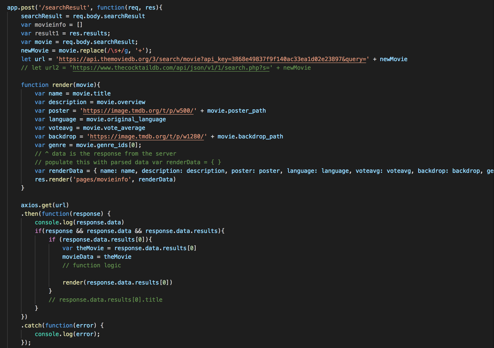
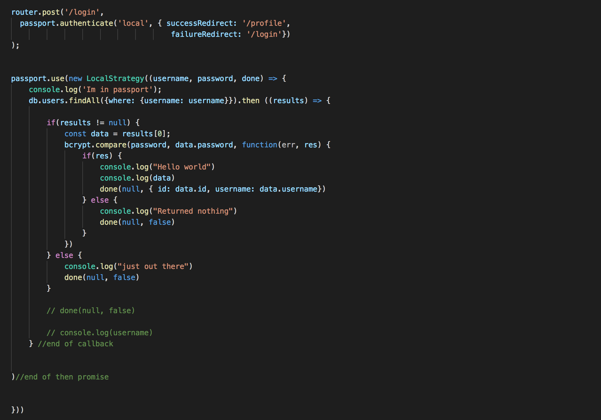
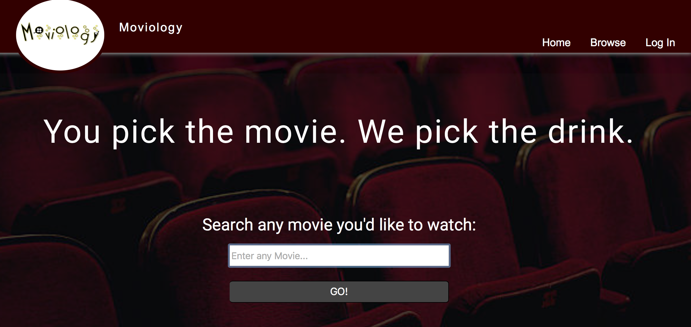
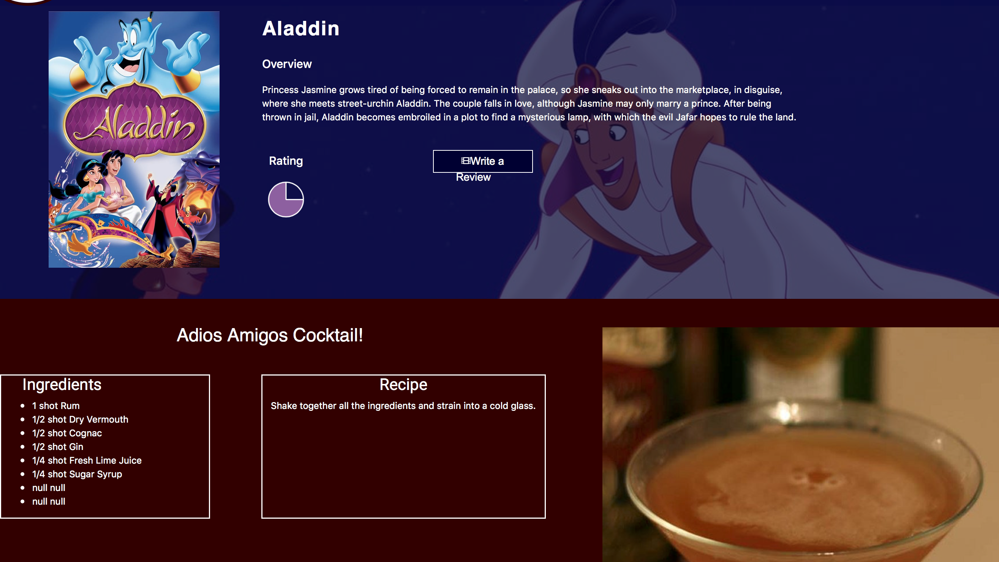

<h1>Moviology</h1>
Visit our webpage at www.moviology.xyz

<h2>Introduction</h2>
Have you ever wanted to watch a movie and realized you needed a drink? But the problem is, you don't know what drink you want. The choices are endless. Even if you could pick, what does the drink entail? .......That's where Moviology comes in!!!

The purpose of this web application is to create a fun, user friendly site to assist people in their movie searches. Unlike most movie websites, Moviology is different in that once you select a movie, the program will select a specific drink for you.  The program is designed to select a cocktail based on the genre of the movie.

The user can create his/her own profile and login at any time to enjoy their own movie experience.  In addition, the user can submit reviews for any movie that they wish to comment on. These pieces of information will be stored in our database.

<h2>Description</h2>
Here you will be building on some of the front end skills that you've utilized previously such as HTML, CSS, and Javascript. Instead of focusing on the client side of a web page, you'll create a more dynamic, single paged application from back end tools. You'll employ the javascript framework, Node.js to create a server side environment to run your application and store the information from your page in a database. A few APIs have been incorporated to make the project interesting. 

<h2>Prerequisites</h2>
For this project, you will need to have a source code editor. You will need to install node along with the following packages:
axios, bluebird, body-parser, ejs, express, pg, pg-hstore, and sequelize.
 
If you plan on deploying your project, a domain name needs to be purchased. The site can be launched on Amazon Web Services(AWS) along with creating and connecting your PostgreSQL relational database. Due to the lengthy process, the documentation for these two items have been attached.... <a href="https://docs.aws.amazon.com/AmazonS3/latest/dev/website-hosting-custom-domain-walkthrough.html">Launching on AWS</a> & <a href="https://aws.amazon.com/getting-started/tutorials/create-connect-postgresql-db/">Connecting PostgreSQL Database.</a>

<h2>Technologies Used</h2>
Code
<li>HTML/CSS</li>
<li>Javascript</li>
<li>JQuery</li>
<li>Node</li>
<li>Express</li>
<li>EJS</li>
<li>API's: Movie DB &and; TheCocktailDB</li>
<li>Source Code Editor(i.e. Visual Studio Code)</li>

 
Database
<li>PostgreSQL</li>
<li>Postico</li>
<li>Sequelize</li>

 
Misc.
<li>Github</li>
<li>AWS</li>

<h2>Example Code</h2>
To see the full code, please visit <a href="">Drinks-Movies-App</a> on Github.
<h4>Movie Search</h4>

<h4>Login Page</h4>

<h2>Example of Live Application</h2>
<h4>Movie Search</h4>

<h4>Movie Result</h4>

<h2>Video</h2>
<a href="https://www.youtube.com/watch?v=xs2RRjuVijg">Demo of the website</a>

<h2>Authors</h2>
<li>Cantu, Melissa</li>
<li>Duong, Jeff</li>
<li>Hunt, Skylar</li>
<li>Pittman, Keith</li>

<h2>Acknowledgments</h2>
We would like to thank Veronica Lino and our TA, Matthew Baxter (database deployment is not easy). Also, we'd like to thank <a href="https://www.themoviedb.org">The Movie DB</a> and <a href="https://www.thecocktaildb.com">TheCocktailDB</a> for their contributions.
